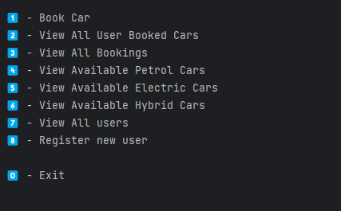

# CLI Car Booking project
### **Built in IntelliJ / Maven**

**src/main/java/com/popjak/**

Project is a result of amigoscode **Java Master Class** course.
https://amigoscode.com/p/java-master-class

I was building this project while progressing through the course. I was gradually implementing new concepts I have learned on this course. Project has been moved to Maven.

---
### **Concepts included in this project**
- Java Basics (variables, loops, methods, data structuress.....)
- **Work with files**
- **Streams**
- **OOP**
- **Interfaces**
- **Solid principals**
- **N-Tier Architecture**
- **Basic dependency injection**
- **Basic Spring Boot annotations already implemented**

Currently working on Spring Boot and Dependency Injection. 

Plan is to connect the project to database and create API which is going to return jason 
based on specific criteria.

