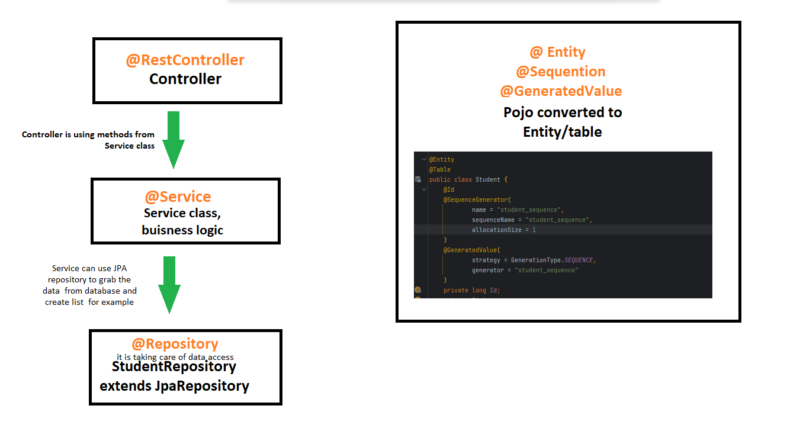

# Student API made in Spring Boot
Student API is able to connect to database in PostgreSQL and perform operations as post, delete, put.
API was running on local server. 

---

### What was implemented in this project

- Spring Boot 3.0.4
- Annotations
- N - Tier Architecture (Client -> API Layer, Service Layer, Data Access Layer)
- Dependency Injection
- SQL queries
- Java
- Json
- Custom exceptions
- Maven 

