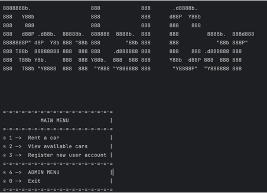
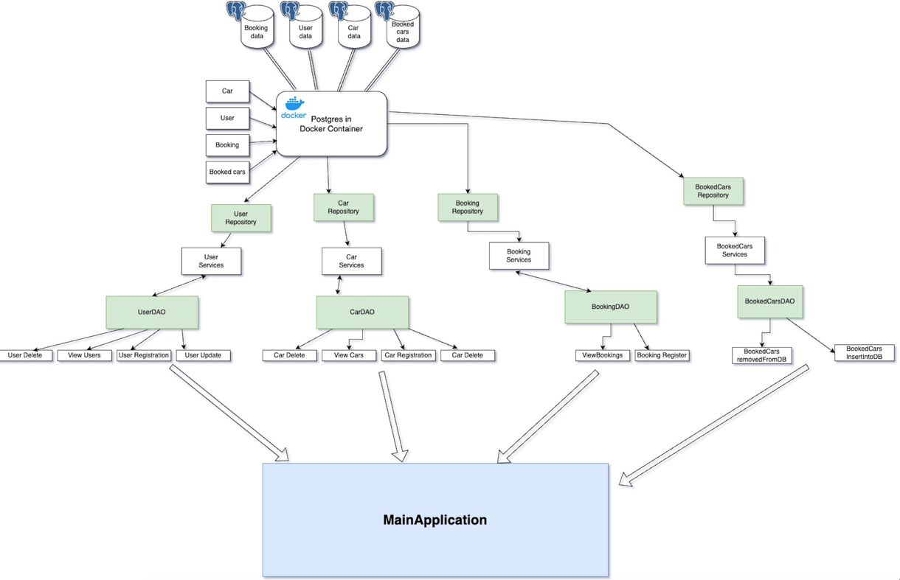
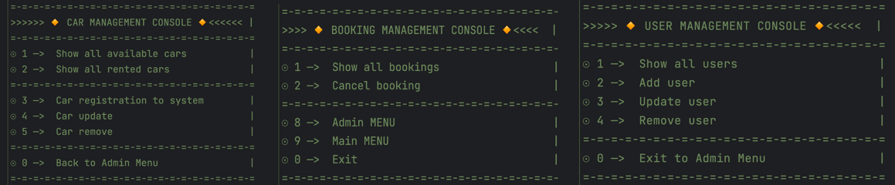

# Rental Car Software
***
## Project Overview
This repository contains a rental car software project developed independently, without following a step-by-step course tutorial.
Rental Car Software CLI is a Java project that provides a command prompt interface for managing car rentals.
Developed using Java 17, Maven, Spring Boot 3, Hibernate JPA, PostgreSQL, and Docker. The project consists of five modules: Menu Selection, Car, User, Booking, and BookedCar.

## Project Origin

This project is an independent solo project and not the result of following any specific course or program. It has been developed to practice Java, Spring Boot, Docker and other technologies.

## Technologies Used

The project utilizes the following technologies and frameworks:

* Java 17 / MAVEN: A robust and widely-used programming language for developing enterprise-grade applications.
* Spring 6 and Spring Boot 3: A powerful and modular framework for building Java applications, providing support for dependency injection, MVC architecture, and more.
* Hibernate JPA: An object-relational mapping (ORM) framework that simplifies database operations by mapping Java objects to database tables.
* PostgreSQL in DOCKER: The Rental Car Software CLI utilizes a PostgreSQL database running on Docker to efficiently manage and store car rental data. Leveraging the power of Docker, this feature ensures seamless database operations, enhancing the reliability and scalability of the application.
* Other relevant libraries and tools that complement the core technologies.

## Project Structure

The project is organized into the following modules:
1. Menu Selection: Responsible for handling menu selection and user input.
2. Car: Handles car-related functionality, including connecting to the database and interacting with the car repository. Submodules handle car registration, update, removal, and listing from the database.
3. User: Manages user-related operations, such as connecting to the database and interacting with the user repository. Submodules handle user registration, update, removal, and listing from the database.
4. Booking: Handles booking functionality, including connecting to the database and managing bookings. Submodules take care of booking registration, update, removal, and listing from the database.
5. Booked Car: Manages booked car operations, such as connecting to the database and interacting with the booked car repository. Submodules handle booked car registration, update, removal, and listing from the database.

## Unit Testing

Unit testing has been implemented for various methods within this project. It ensures the correctness of individual components and helps maintain the overall quality of the software.

## Getting Started

To set up and run the rental car software project locally, follow these steps:
Clone the repository to your local machine.
Ensure that you have Java, Spring 6, and Hibernate JPA installed and properly configured.
Configure the database connection details in the project's configuration files.
Build and deploy the project using the appropriate tools and commands.
Access the application Command prompt.

## Instructions

To build and run the project, follow these steps:
To set up and run the rental car software project locally, follow these steps:
1. Clone the repository to your local machine.
2. Ensure you have Java 17 and Maven installed on your system.
3. Set up a PostgreSQL database and configure the connection details in the project configuration files.
4. Build the project using Maven: mvn clean installation.
5. Run the project using the Spring Boot Maven plugin: mvn spring-boot:run.

   Note: Docker can also be used to containerize the application, allowing for easier deployment and management.

## CONTACT

apopjak@gmail.com